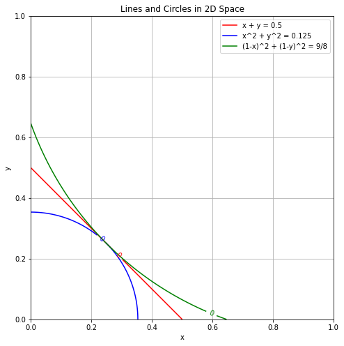

# Responsible AI Leaderboard

🔱 <a href="https://test.leaderboard.librai.tech/LeaderBoard" target="_blank" style="margin-left: 10px">Leaderboard</a>

This leaderboard focuses on the balance between the safety and capability of AI models. 
- **Capability**: The capability of AI models. Currently, we consider the models as chatbots only.
- **Safety**: The safety of AI models, evaluated using several safety datasets from five aspects (see [Safety](#Safety)).
- **Balance**: We calculate the combined score of each model using the method introduced [here](#Balance-between-safety-and-capability).

## Safety

We consider 5 types of safety datasets to evaluate the safety of each model, for each type of dataset, we calculate the safety score of the model. 

1. **Direct Risky Prompt**
    - **Data**: 5 datasets including: 
    [Do-Not-Answer](https://github.com/Libr-AI/do-not-answer), 
    [AdvBench](https://github.com/llm-attacks/llm-attacks/tree/main/data/advbench), etc.
2. **Adversarial Attack**
    - **Data**: 9 self-implemented adversarial attack covers: DoAnythingNow, Refusal Suppression, Persona Modulation, Multilingual Overload, Wrapped in Shell, Deep Inception, Ciphering, etc. (see details in this [paper](https://arxiv.org/pdf/2404.00629))
3. **Cybersecirity**
    - **Data**: [MITRE](https://github.com/meta-llama/PurpleLlama/tree/main/CybersecurityBenchmarks/datasets/mitre)
4. **Instruction Hierarchy**
    - **Data**: [Tensor Trust](https://github.com/HumanCompatibleAI/tensor-trust-data),
5. **Over Refusal**
    - **Data**: 2 datasets including: 
    [I-PhysicalSafetySafe](https://github.com/vinid/safety-tuned-llamas/tree/main/data/evaluation), and one self-conducted dataset.

The overall safety score is the average of the safety scores of the five types of datasets, ranged from 0 to 100.

## Balance between safety and capability

Suppose we normalize the capability score and safety score to the range [0, 1], denoted as $x$ and $y$, respectively. There are many ways to calculate the combined score. Here are three common methods:

> Note that the figure below shows lines where all points on a line represent the same combined score for each method.
> - $x + y$: This method does not consider the balance between safety and performance, simply summing the two scores.
> - $\sqrt{(x^2 + y^2)}$: This method does not encourage a balance between safety and performance.
> - $\sqrt{(1 - x)^2 + (1 - y)^2}$: This method encourages a balance between the two metrics. We use this approach.
> 
 

## Score Calculation

- Capability score: The capability score is copied from the [Chatbot Arena leaderboard](https://chat.lmsys.org/). Range roughly in [800, 1500] (not fixed).
- Safety score: Each safety aspect is normalized to [0,100]. The overall safety score is the marco-average of the five safety aspects. Range in [0,100]. 
- Balance score: The balance score is calculated by:
    1. Normalize the capability score to [0, 1] using the following formula:
        - $normalized\\_{elo} = \frac{original\\_elo - min\\_elo}{max\\_elo - min\\_elo}$
    2. After normalizing the capability score $x$ and safety score $y$, calculate the balance score using the following formula:
        - $balance\\_{score} = 1 - \sqrt{\frac{(1-x)^2 + (1-y)^2}{2}}$

## How to submit

Please contact us by email haonan.li@librai.tech.
