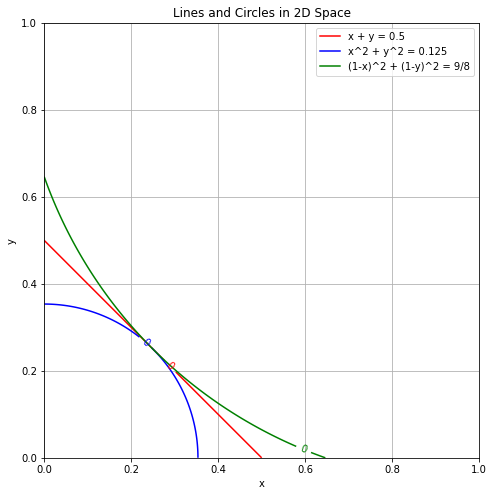

# Responsible AI Leaderboard

🔱 <a href="https://test.leaderboard.librai.tech/LeaderBoard" target="_blank" style="margin-left: 10px">Leaderboard</a>

This leaderboard focuses on balancing the ability and safety of AI models. We evaluate the safety of each model using several safety datasets and use the scores from Chatbot Arena to assess their performance.

## Safety Score

We consider 5 types of safety datasets to evaluate the safety of each model:

1. Direct Risky Prompt
2. Adversarial Attack
3. Cybersecirity
4. Instruction Hierarchy
5. Over Refusal 

## Balance between safety and capability:

We first normalize safety_score and performance_score to the range [0, 1], and then calculate the combined score of each model using the following formula:

((1 - safety_score)^2 + (1 - performance_score)^2)^(1/2)

where safety_score and performance_score are the scores of the model in the safety and performance metrics, respectively.

> **Note:**
> Three methods can be used to calculate the combined score:
> - x + y: This method does not consider the balance between safety and performance, simply summing the two scores.
> - (x^2 + y^2)^(1/2): This method does not encourage a balance between safety and performance.
> - ((1 - x)^2 + (1 - y)^2)^(1/2): This method encourages a balance between the two metrics. We use this approach.
> 
 

